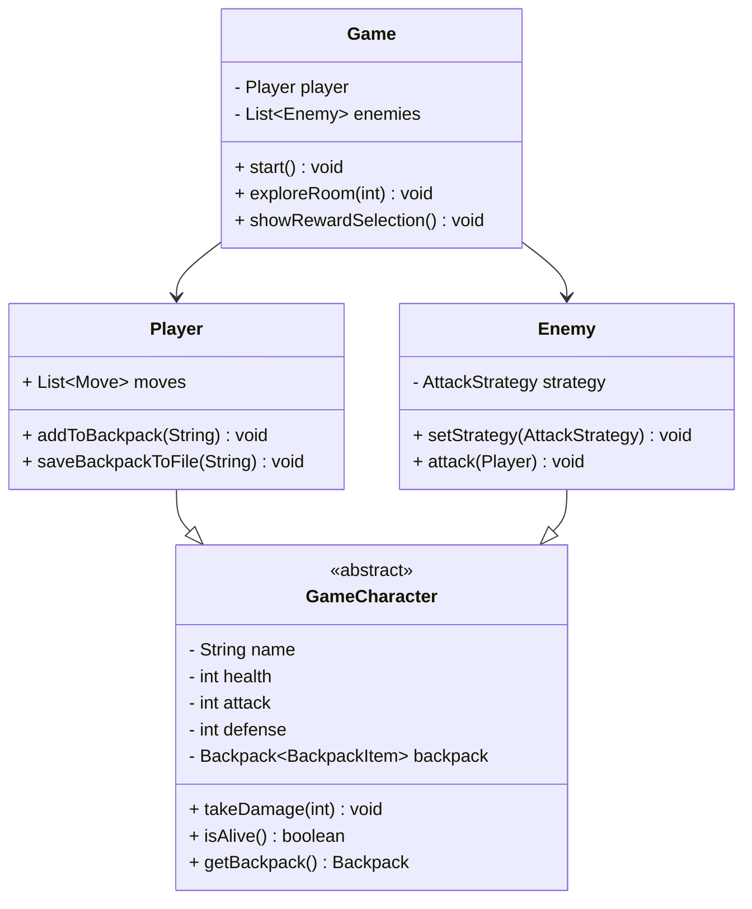
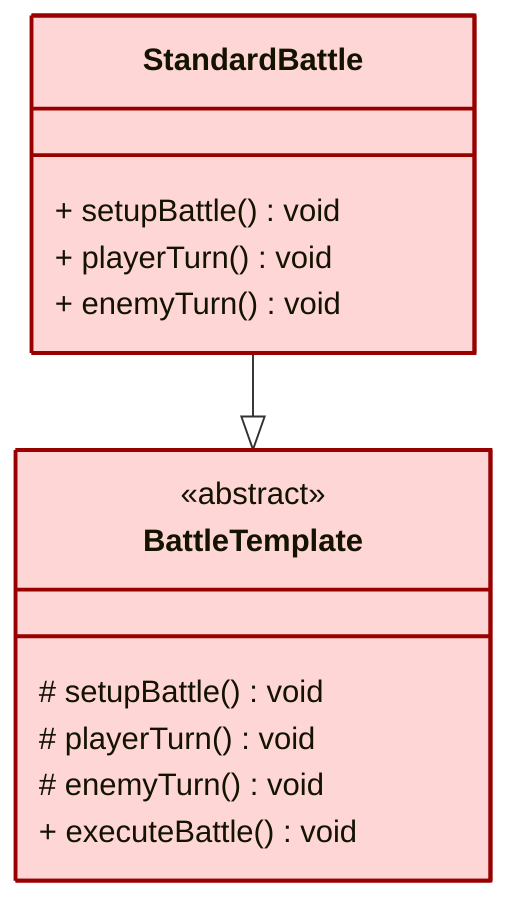
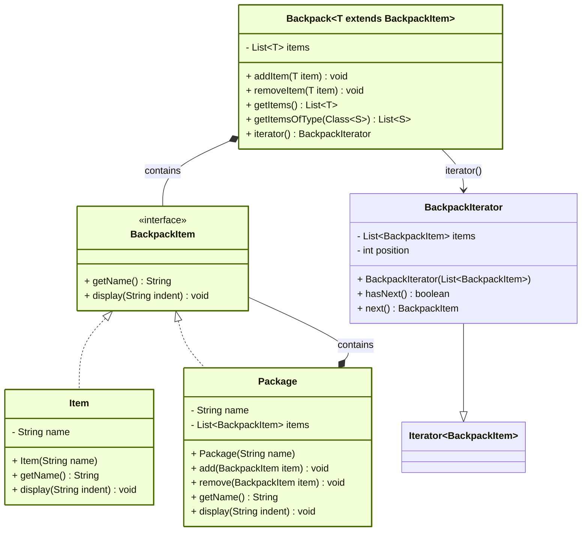
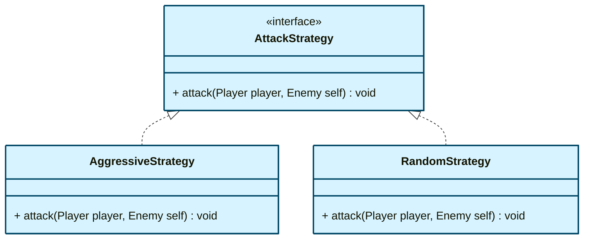
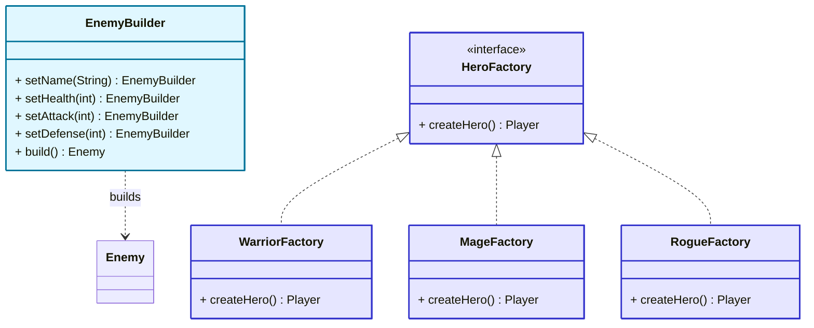
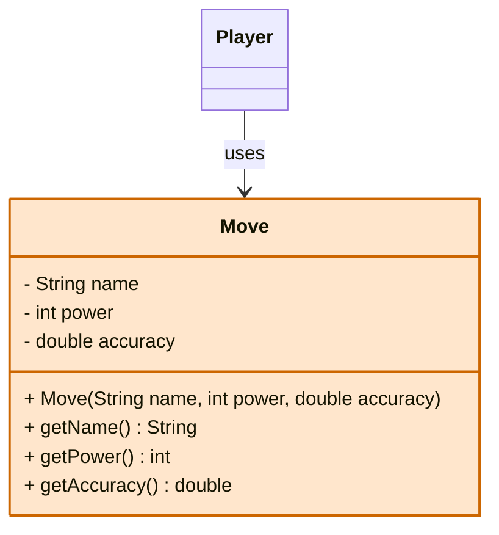
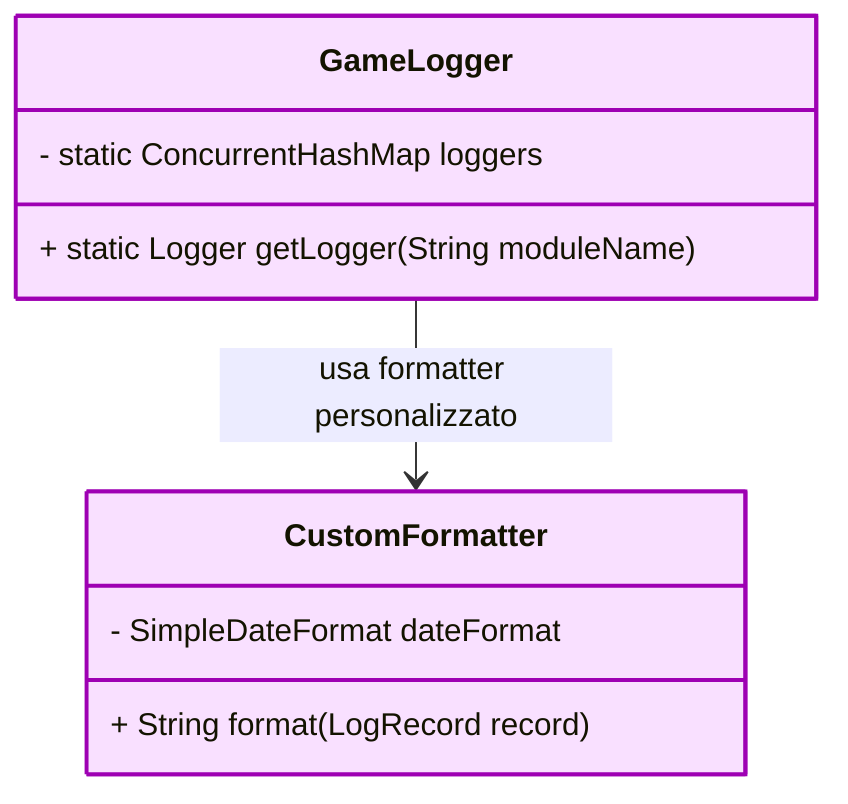
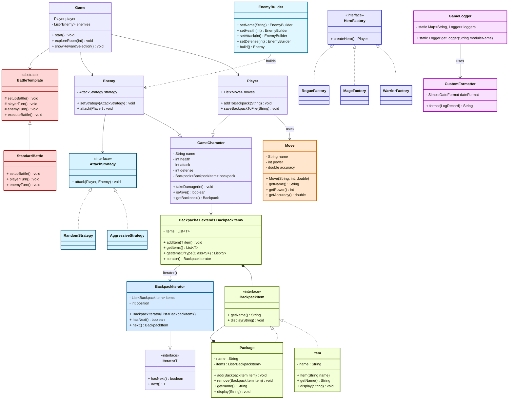

# 🧩 Dungeon Adventure – Overview

**Dungeon Adventure** è un **gioco di ruolo testuale** a turni realizzato in Java, pensato per essere un progetto dimostrativo completo in stile *"dungeon crawler"*.  
L’obiettivo del giocatore è **esplorare tre stanze**, sconfiggere i nemici che vi si nascondono, e **raccogliere ricompense** utili per il proprio inventario.

---

## 🎮 Tipologia di gioco

- **Single Player**
- **Basato su testo (console)**
- **Combattimento a turni**
- **Progressione tramite esplorazione**

---

## 🧙‍♀️ Cosa implementa

| Elemento       | Dettagli |
|----------------|----------|
| 👤 **Personaggi** | Il giocatore sceglie un eroe tra **Guerriero**, **Mago** o **Ladro**, ognuno con abilità diverse |
| 👹 **Nemici**       | Goblin, Orco, Drago – generati dinamicamente con strategie diverse |
| 🎒 **Oggetti**      | Zaino con oggetti semplici (`Item`) o pacchetti (`Package`) annidabili |
| ⚔️ **Mosse**        | Ogni eroe ha mosse personalizzate per attaccare i nemici |
| 🎁 **Ricompense**   | Dopo ogni battaglia il giocatore può scegliere e conservare una ricompensa |

---

## 🛠️ Funzionalità principali

- ✅ Scelta del personaggio con **Factory Pattern**
- ✅ Combattimento a turni con **Template Method Pattern**
- ✅ Inventario strutturato con **Composite + Iterator**
- ✅ Nemici con strategie dinamiche (**Strategy Pattern**)
- ✅ Costruzione nemici tramite **Builder Pattern**
- ✅ Zaino tipizzato con **Java Generics**
- ✅ Input utente protetto con **Exception Shielding**
- ✅ Backpack intregraco con **Collections**
- ✅ Simulazione caricamento stanza con **Multithreading**
- ✅ **Java Logging** per eventi chiave (inizio, ricompensa, nemico) gestitoto con **Singleton**
- ✅ **Salvataggio zaino** su file (`Java I/O`)
- ✅ Test unitari con **JUnit**

---

## 💻 Tecnologie e pattern implementati

- **Java SE 17+**
- `java.util.logging`
- `Scanner` per input
- `BufferedWriter` per salvataggio file
- **JUnit 5** per testing

### 🧩 Design Patterns usati

- Factory  
- Composite  
- Iterator  
- Strategy  
- Template Method  
- Builder
- Exception Shielding 
- Singleton

---
## 🎯 Core Classes – Dungeon Adventure

Le **Core Classes** costituiscono il nucleo funzionale del progetto *Dungeon Adventure*.  
Gestiscono il flusso di gioco, i personaggi (giocatore e nemici), e il sistema di combattimento.  
Queste classi implementano i principali design pattern richiesti come **Template Method**, **Strategy** e **Builder**, e rappresentano la logica centrale del gioco.

---

### 🛡️ Core Classes

- **Game**  
  - Classe principale che gestisce il ciclo di gioco.  
  - Inizializza il personaggio, i nemici e le ricompense.  
  - Contiene il metodo `start()` che avvia l’esplorazione delle stanze e gestisce i combattimenti.  
  - Utilizza le classi `Player`, `Enemy`, `StandardBattle` e `Backpack`.

- **GameCharacter** `abstract`  
  - Superclasse comune per `Player` ed `Enemy`.  
  - Incapsula i dati e metodi condivisi come `name`, `health`, `attack`, `defense`, `takeDamage()` e `isAlive()`.  
  - Ogni `GameCharacter` ha un `Backpack<BackpackItem>` che rappresenta il suo inventario.  
  - Implementa il **Template Method Pattern** tramite metodi base utilizzati in combattimento.

- **Player**  
  - Classe che rappresenta l’eroe scelto dal giocatore.  
  - Estende `GameCharacter` e include una lista di `Move`, oltre a metodi per interagire con lo zaino (`addToBackpack()`, `saveBackpackToFile()`).  
  - Permette al giocatore di selezionare mosse durante il turno.

- **Enemy**  
  - Classe che rappresenta un nemico generato nel dungeon.  
  - Estende `GameCharacter` e integra il **Strategy Pattern** attraverso `AttackStrategy`, permettendo di personalizzare il comportamento d’attacco.  
  - Viene costruito tramite `EnemyBuilder`.

---

### ⚔️ Battle System

- **BattleTemplate** `abstract`  
  - Definisce la struttura del combattimento tramite il **Template Method Pattern**.  
  - Espone metodi astratti `setupBattle()`, `playerTurn()`, `enemyTurn()`, che vengono concretizzati da sottoclassi.

- **StandardBattle**  
  - Implementazione concreta di `BattleTemplate` che rappresenta un combattimento standard uno contro uno tra `Player` ed `Enemy`.  
  - Gestisce l’ordine di attacco, la logica dei turni e la conclusione della battaglia.

## 🎒 Support Classes – Dungeon Adventure

### Support Structures

- **Backpack<T extends BackpackItem>**  
  - Sistema di inventario generico, implementato con il **Composite Pattern**.  
  - Permette di contenere oggetti semplici (`Item`) e oggetti complessi (`Package`) nidificati.  
  - Supporta la ricerca tipizzata tramite **Java Generics** e l’iterazione con un **BackpackIterator** personalizzato.

- **BackpackItem** `interface`  
  - Rappresenta un elemento contenibile nello zaino.  
  - Espone i metodi `getName()` e `display(indent)` per la visualizzazione gerarchica.

- **Item**  
  - Oggetto semplice che implementa `BackpackItem`.  
  - Ha solo un nome ed è l’unità minima contenibile nello zaino.

- **Package**  
  - Contenitore ricorsivo che implementa `BackpackItem`.  
  - Può contenere una lista di altri oggetti (inclusi altri package) e si comporta come nodo composito.

- **BackpackIterator**  
  - Implementazione concreta dell’interfaccia `Iterator<BackpackItem>`.  
  - Permette la scansione sequenziale degli elementi presenti nello zaino.

---

### 🗡️ Combat & Behavior

- **AttackStrategy** `interface`  
  - Componente chiave del **Strategy Pattern**.  
  - Definisce l’interfaccia per le strategie di attacco dei nemici (`attack(Player, Enemy)`).

- **AggressiveStrategy / RandomStrategy**  
  - Implementazioni concrete della strategia di attacco.  
  - L'aggressiva attacca sempre, la random usa logica casuale.

---

### 🧱 Construction & Logic

- **EnemyBuilder**  
  - Implementazione del **Builder Pattern** per la creazione di nemici.  
  - Supporta la creazione fluente tramite metodi `setName`, `setHealth`, `setAttack`, `setDefense`, e `build()`.

- **HeroFactory (e sottoclassi)**  
  - Implementazione del **Factory Pattern** per la creazione dei personaggi principali (`Warrior`, `Mage`, `Rogue`).

---

### 🧠 Game Logic

- **Move**  
  - Rappresenta una mossa eseguibile dal giocatore.  
  Contiene nome, potenza e precisione.  
  - È utilizzata dal sistema di combattimento durante il turno del giocatore.

###  Game Logger

Il sistema di logging è composto da due componenti principali:

- **GameLogger**  
  Classe singleton che centralizza la creazione e la configurazione dei logger.  
  Gestisce `ConsoleHandler` e `FileHandler`, e registra i dati in un file `.txt`.

- **CustomFormatter**  
  Formatter personalizzato che estende `Formatter` di Java.  
  Definisce il formato leggibile per ogni riga di log (timestamp, livello, messaggio).  
  Utilizzato internamente da `GameLogger`.

---
## Class Diagram – Dungeon Adventure
